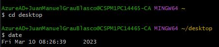
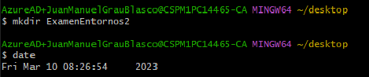
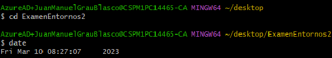
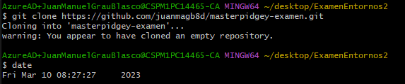
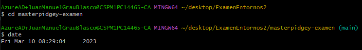
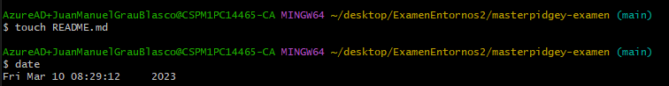
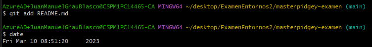
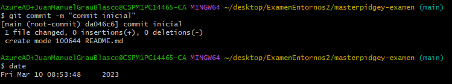

El ejercicio de examen lo empezamos primeramente creando un nuevo repositorio en nuestros repositorios de github llamado "masterpidgey-examen", este repositorio después lo clonaremos en nuestro pc local para realizar las modificaciones necesarias.
Primeramente con git bash nos ubicaremos en el escritorio del ordenador así:

Después tendremos que crear una nueva carpeta en el escritorio, lo podemos hacer manualmente o con mkdir:

Luego debemos ubicarnos en esta carpeta para clonar el repositorio:

Ahora ya podremos hacer el git clone y clonar nuestro repositorio de forma local:

Ahora nos tendremos que ubicar dentro del repositorio que hemos clonado desde la carpeta que hemos creado:

Ahora pasamos a crear un nuevo documento dentro del repositorio que hemos clonado llamado "README.md" (lo podríamos crear manualmente, en mi caso lo he hecho con touch):

Posteriormente ya podremos hacer el commit para después hacer el push al repositorio con todos los cambios realizados hasta ahora, primeramente haremos un git add del README y después un git commit (también deberíamos hacer un git add de la carpeta con las imágenes que utilicemos en este README en caso necesario):

