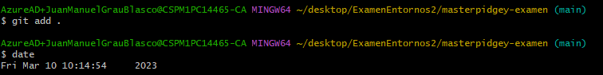
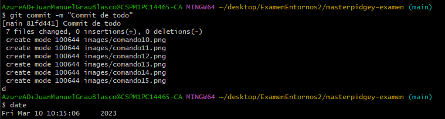
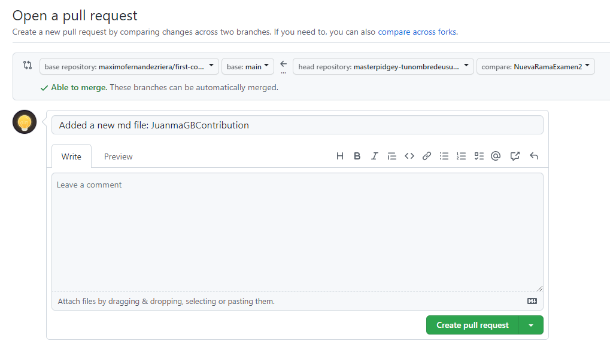

PRIMERA PARTE:

El ejercicio de examen lo empezamos primeramente creando un nuevo repositorio en nuestros repositorios de github llamado "masterpidgey-examen", este repositorio después lo clonaremos en nuestro pc local para realizar las modificaciones necesarias.
Primeramente con git bash nos ubicaremos en el escritorio del ordenador así:

Después tendremos que crear una nueva carpeta en el escritorio, lo podemos hacer manualmente o con mkdir:

Luego debemos ubicarnos en esta carpeta para clonar el repositorio:

Ahora ya podremos hacer el git clone y clonar nuestro repositorio de forma local:

Ahora nos tendremos que ubicar dentro del repositorio que hemos clonado desde la carpeta que hemos creado:

Ahora pasamos a crear un nuevo documento dentro del repositorio que hemos clonado llamado "README.md" (lo podríamos crear manualmente, en mi caso lo he hecho con touch):

Posteriormente ya podremos hacer el commit para después hacer el push al repositorio con todos los cambios realizados hasta ahora, primeramente haremos un git add del README y después un git commit (también deberíamos hacer un git add de la carpeta con las imágenes que utilicemos en este README en caso necesario):

Ahora ya podremos realizar el push:

(IMPORTANTE: He realizado 3 pushes, el correcto es el último que he realizado, los otros 2 los he hecho sin las imágenes correspondientes así que están mal y no se deben tener en cuenta)

Ahora pasaremos a crear unos nuevos archivos dentro de nuestro repositorio local, para ello debemos tener en cuenta de que estamos ubicados en la carpeta correcta y si lo estamos haremos un touch y un mkdir:

Estos archivos que hemos creado tienen que ser ignorados automáticamente, para ello crearemos un nuevo archivo llamado ".gitignore.txt", en este archivo podemos poner todos los nombres de los ficheros y carpetas que queramos que se ignoren (con touch creamos el archivo txt y con nano lo editamos, el contenido del fichero debe ser en una línea: "privada" y en otra: "privado.txt", cuando hayamos terminado de editar con nano solo debemos pulsar Ctrl+X y la letra "y" para confirmar, después nos pedirá un nombre para darle al archivo pero en nuestro caso no debemos modificar su nombre):

Ahora debemos añadir el fichero 1.txt al repositorio local, para ello debemos hacer lo mismo que antes, un touch:

Haremos una pausa para ver todos los commits realizados hasta ahora:

Como he dicho antes, solo se debe tener en cuenta el más reciente ya que es el único realizado correctamente con todas las imágenes, así que en todo caso solo deberíamos ver 1 commit de momento.

Ahora pasaremos a crear un tag, pero primero antes de ello deberemos hacer un commit con todas las modificaciones que hayamos hecho, para ello ejecutamos los siguientes comandos:

Ahora pasaremos a crear el tag y a subir este tag de forma remota a nuestro repositorio, para ello ejecutamos lo siguiente:

Historial de commits:

(Solamente se deben tener en cuenta el "Commit de todo" y el más reciente de los que se llaman "commit inicial")

Ahora creamos una tabla en este mismo README:

| NOMBRE | GITHUB |
|--------|--------|
|Máximo Fernández Riera|http://github.com/maximofernandezriera|

Ahora agregamos a un colaborador a nuestro repositorio masterpidgey-examen, en nuestro repositorio iremos a "Settings" y en la parte de la izquierda veremos el apartado de "Collaborators":

Le damos a "Collaborators" y tendremos la opción en el botón verde de "Add people" para añadir a los usuarios que queramos:

Se nos abrirá una ventana donde tendremos un buscador, buscaremos al usuario y le daremos click al botón verde para añadirlo:

SEGUNDA PARTE:

Vamos a hacer una contribución a un proyecto de otro usuario, para ello primero hacemos un fork de este proyecto, iremos a la página del repositorio y haremos un nuevo fork en nuestros repositorios locales de github.

Cuando ya hayamos hecho el fork deberemos clonar el repositorio localmente a nuestro equipo (creamos la carpeta y hacemos todo lo necesario):

Ahora crearemos un nuevo branch donde haremos las modificaciones que queramos primeramente accediendo a la carpeta del repositorio:

Accedemos al branch:

Realizamos algún cambio de los archivos que tenemos en el repositorio local(en mi caso he creado un nuevo archivo llamado "JuanmaGBContribution.md"):

Este archivo en este caso yo lo he editado y al acabar de editarlo lo he guardado, después de guardarlo ya podemos hacer el git add y el commit:

Ahora ya podemos hacer el push de los cambios en nuestro repositorio de github forkeado:

Ya hemos hecho el push en el repositorio forkeado pero queremos hacer el pull request en el repositorio original del usuario del cual hemos hecho el fork. Para ello deberemos ejecutar el siguiente comando para especificar un nuevo repositorio remoto y sincronizar los archivos que cambiemos en el nuestro con el otro (el git remote -v de después sirve para ver el historial):

Después pasaremos a sincronizar el fork nuestro con el original, para ello ejecutamos:

Ahora cambiamos a la rama main de nuestro repositorio y hacemos un merge del upstream con la rama main. Esto hará que se fusionen los cambios realizados con el repositorio original:

En este punto ya seremos capaces de hacer una pull request al repositorio original, para ello iremos a github a nuestro repositorio que hemos hecho fork (el nuestro) y nos saldrá un botón arriba: "Compare & pull request"

Le damos al botón y nos sale una ventana para hacer el pull request, si todo lo hemos hecho de forma correcta nos dejará hacer el pull request en el repositorio original del cual hemos hecho el fork:

Le damos al botón verde de "Create pull request" y habremos acabado por completo el ejercicio.

CONCLUSIÓN:

En el examen hemos podido ver los diferentes usos que le podemos dar a Github y cómo manejar cada uno de los comandos para realizar cualquier tipo de operaciones en los repositorios que queramos. Hemos aprendido cosas importantes como el commit, el archivo README y muchas cosas más que son esenciales a la hora de ser un programador y subir nuestros archivos a Github, creo que es algo muy importante de aprender también el tema de los tags y los branches sobre todo para el futuro ya que podremos estar con mucha gente y cada una querrá realizar unos cambios en un repositorio en concreto.